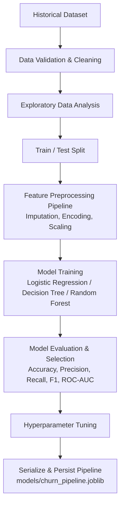
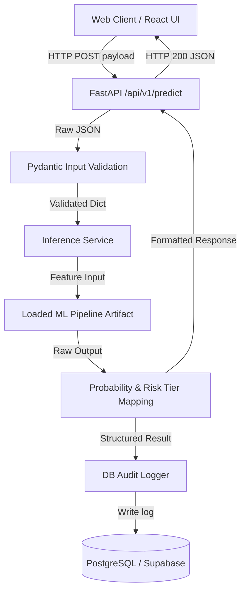

# Architecture Document: Customer Churn Prediction & Business Intelligence System

This document describes the high-level architecture, component boundaries, data flows, and design principles for the Customer Churn Prediction & Business Intelligence System.

---

## 1. System Overview

The system is structured as a decoupled, multi-tier application designed to predict customer churn probability and present business intelligence metrics. 

The system logically isolates offline machine learning pipeline generation from real-time API inference and web presentation:

```
┌─────────────────────────────────────────────────────────────────────────┐
│                           OFFLINE PIPELINE                              │
│                                                                         │
│  Raw Data  ──► Data Validation ──► Feature Pipeline ──► ML Model Train │
│                                                               │         │
│                                                               ▼         │
│                                                     Persisted Artifact  │
└───────────────────────────────────────────────────────────────┬─────────┘
                                                                │
┌───────────────────────────────────────────────────────────────┼─────────┐
│                           ONLINE SYSTEM                       │         │
│                                                               ▼         │
│  React Frontend ◄──► FastAPI Backend ──► Inference Service (Pipeline)  │
│                           │                                             │
│                           ▼                                             │
│                   PostgreSQL / Supabase                                 │
└─────────────────────────────────────────────────────────────────────────┘
```

---

## 2. Component Architecture

The software architecture consists of four primary components:

1. **ML Training & Pipeline Engine (`src/`):**
   * Handles dataset ingestion, cleaning, feature transformation, model training, hyperparameter tuning, and evaluation.
   * Exports a single, self-contained `scikit-learn` Pipeline artifact containing all fitted transformers and the trained classification model.

2. **FastAPI REST Service (`backend/`):**
   * Acts as the interface between API clients / web frontend and the underlying prediction engine.
   * Validates incoming request payloads via Pydantic schemas.
   * Loads the persisted ML pipeline artifact to execute real-time predictions.
   * Dispatches analytics queries and persists prediction audit logs to the database.

3. **React Web Dashboard (`frontend/`):**
   * Provides an interactive UI for business analysts and users.
   * Features a Single Customer Risk Predictor form and a Business Analytics Dashboard.
   * Communicates asynchronously with the backend API via REST.

4. **Database Service (`PostgreSQL / Supabase`):**
   * Persists application-level prediction history, input feature snapshots, prediction timestamps, and risk classification outputs.

---

## 3. ML Training Flow

The machine learning training workflow is executed offline (or on scheduled batch runs). Data transformation logic is encapsulated inside a reusable pipeline to eliminate training-serving skew.

### Training Data Flow Diagram



### Detailed Steps:
1. **Validation:** Checks raw data for schema consistency and corrupt entries.
2. **Splitting:** Stratified split into training and test sets *before* fitting any scale or encoding parameter.
3. **Preprocessing:** Fits ColumnTransformers (imputers, one-hot encoders, scalers) strictly on training data.
4. **Training & Tuning:** Fits candidate models, tunes hyperparameters using Stratified K-Fold Cross-Validation.
5. **Evaluation:** Evaluates models on held-out test data across multiple classification metrics and business tradeoff analyses.
6. **Serialization:** Exports the fitted preprocessing + champion model as a single joblib pipeline artifact.

---

## 4. ML Inference Flow

Real-time inference processes individual customer attribute payloads via the FastAPI service.

### Inference Data Flow Diagram



### Risk Level Mapping Logic
Raw probability outputs are mapped into actionable business risk levels:
* **Low Risk:** Probability < 0.35
* **Medium Risk:** 0.35 ≤ Probability < 0.70
* **High Risk:** Probability ≥ 0.70

---

## 5. Backend Architecture

The backend application follows a clean layered structure:

```
backend/
├── app/
│   ├── main.py             # FastAPI App entrypoint & middleware setup
│   ├── api/                # API Route endpoints (/predict, /analytics, /health)
│   ├── core/               # App configuration & settings (pydantic-settings)
│   ├── schemas/            # Pydantic request/response validation schemas
│   ├── services/           # Business logic (inference service, analytics service)
│   └── db/                 # Database models, connection sessions, and queries
```

* **Validation:** Strict payload validation via Pydantic to ensure input attributes match required data types.
* **Error Handling:** Standardized JSON error responses for invalid inputs, missing fields, or internal service errors.
* **Modularity:** Inference logic is isolated inside `services/` so API routes remain lightweight.

---

## 6. Frontend Architecture

The frontend application is built as a single-page React application:

```
frontend/
├── src/
│   ├── components/         # Reusable UI components (Nav, Header, RiskBadge, Charts)
│   ├── pages/              # View pages (PredictorPage, AnalyticsPage, ModelInfoPage)
│   ├── services/           # REST API client logic (Axios / Fetch)
│   ├── styles/             # Modular CSS styles and design system tokens
│   └── App.jsx             # Main routing and layout wrapper
```

* **Form State:** Manages customer feature input fields with validation prior to API dispatch.
* **Visualizations:** Visual charts display churn distributions and feature importance statistics.

---

## 7. Database Role

The database handles application-level persistence and historical tracking. It is **not** used to store model weights or raw training datasets.

### Schema Definition: `prediction_logs`
* `id` (UUID / Primary Key): Unique prediction log identifier.
* `customer_id` (String, Optional): Identifier for the customer being evaluated.
* `input_payload` (JSONB): Full input feature dictionary passed to prediction engine.
* `churn_probability` (Float): Model estimated churn probability (0.00 to 1.00).
* `predicted_class` (Integer): Binary classification output (0 or 1).
* `risk_level` (String): Mapped human-readable risk category (Low, Medium, High).
* `created_at` (Timestamp): Record creation timestamp.

---

## 8. Separation Between Training and Inference

A core architectural principle of this system is the strict separation between ML training and ML inference:

| Aspect | ML Training Pipeline | ML Inference API |
| :--- | :--- | :--- |
| **Execution** | Batch / Offline script | Event-driven HTTP REST server |
| **Input Data** | Historical dataset files (CSV/Parquet) | Single JSON payload via POST request |
| **Processing** | Full dataset transformations & cross-validation | Single record transformation via pre-fitted Pipeline |
| **Dependencies** | Heavy training libraries (scikit-learn, pandas) | Lightweight prediction runner (scikit-learn runtime) |
| **State** | Generates new parameter fits & metrics | Immutable execution of loaded pipeline weights |

---

## 9. Future Deployment Architecture

For production containerized deployment:

```
                        ┌──────────────────────────────┐
                        │      Cloud Load Balancer     │
                        └──────────────┬───────────────┘
                                       │
                      ┌────────────────┴────────────────┐
                      │                                 │
                      ▼                                 ▼
           ┌─────────────────────┐           ┌─────────────────────┐
           │   React Container   │           │   FastAPI Container │
           │   (Nginx Web Server)│           │      (Uvicorn API)  │
           └─────────────────────┘           └──────────┬──────────┘
                                                        │
                                                        ▼
                                             ┌─────────────────────┐
                                             │ Managed PostgreSQL  │
                                             │  (Supabase / Cloud) │
                                             └─────────────────────┘
```

* **Orchestration:** Managed via `docker-compose.yml` for local development and multi-container environments.
* **Scalability:** The stateless FastAPI container can be scaled horizontally behind a load balancer.
