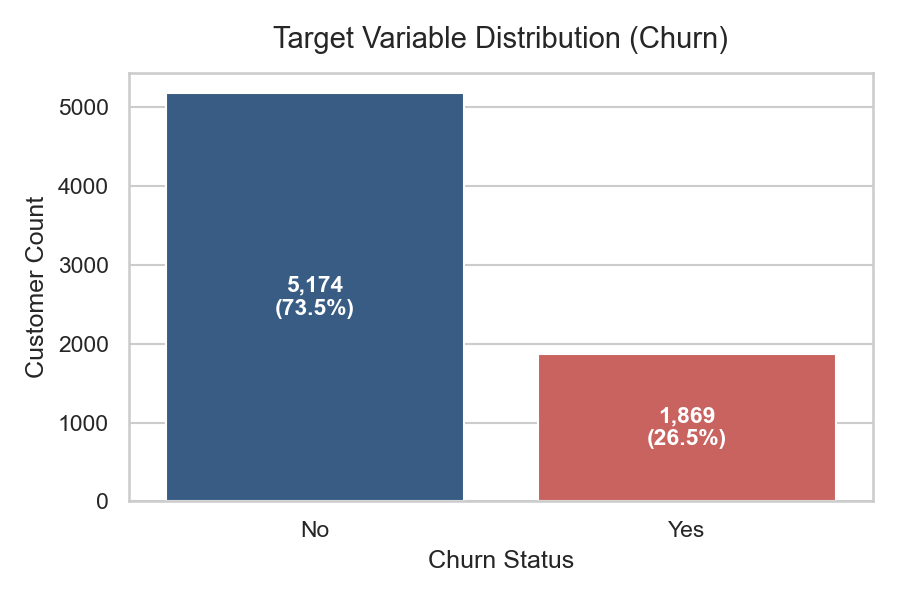
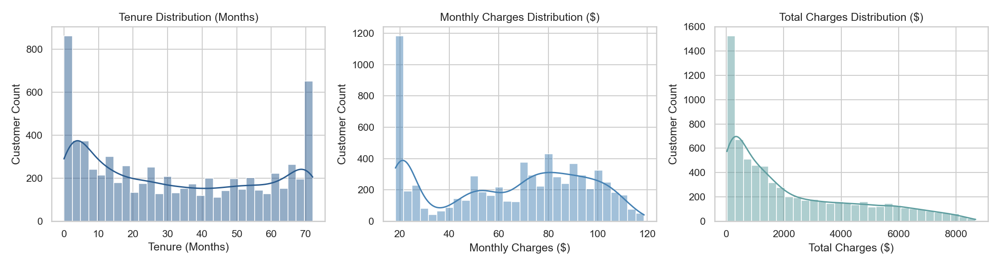
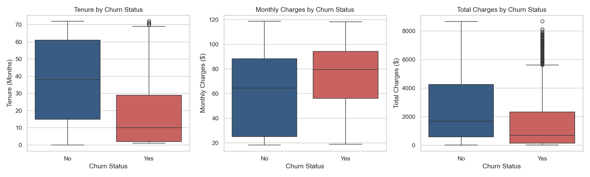
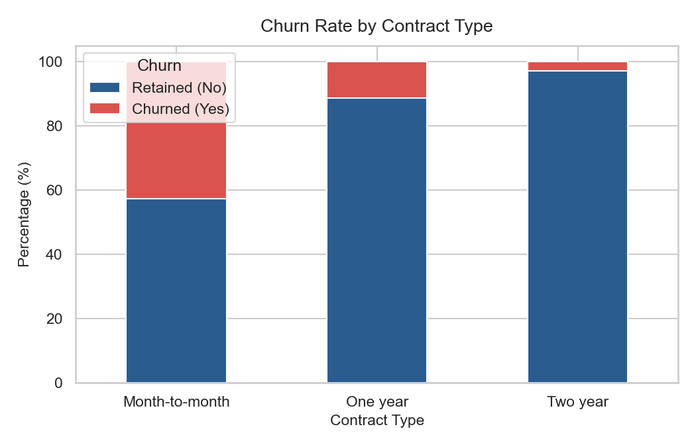
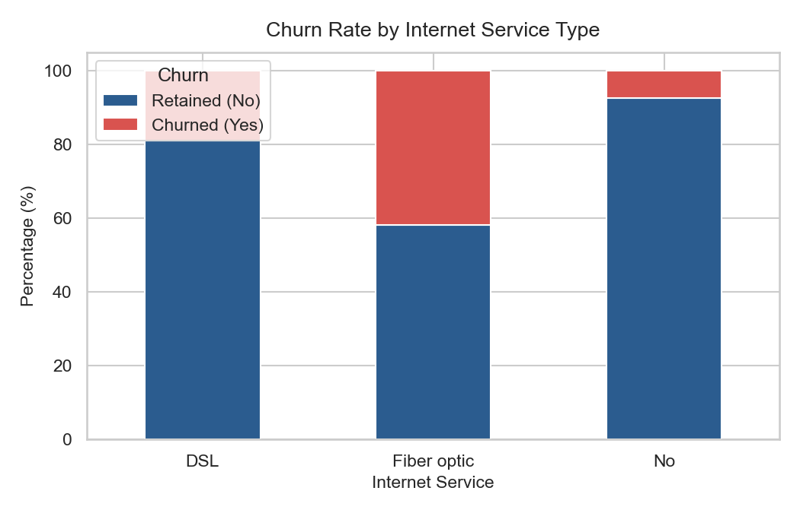
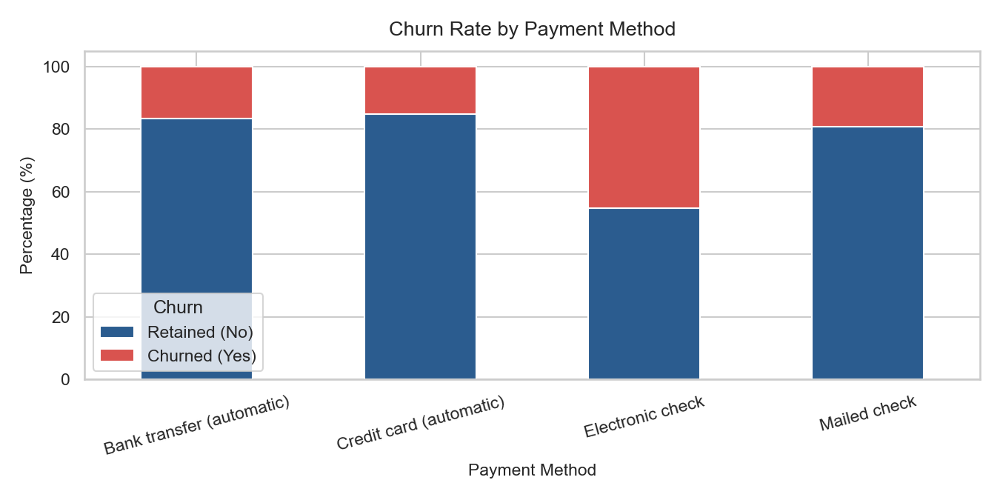
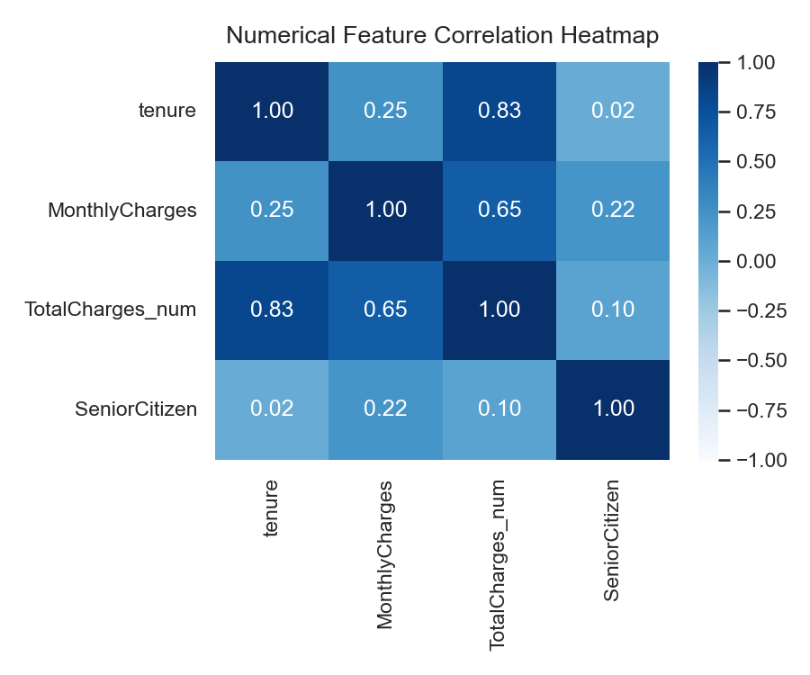

# Exploratory Data Analysis Report: Telco Customer Churn

**Project:** Customer Churn Prediction & Business Intelligence System  
**Phase:** Phase 3 — Exploratory Data Analysis (EDA)  
**Dataset:** IBM Telco Customer Churn (`WA_Fn-UseC_-Telco-Customer-Churn.csv`)  
**Date:** September 26, 2026  

---

## 1. Objective

The objective of Phase 3 is to systematically explore the historical Telco customer dataset to identify empirical patterns, feature distributions, feature-to-feature relationships, potential outliers, and statistical associations with customer churn. 

This phase is purely exploratory. No machine learning models were trained, no feature transformations were saved, no rows were deleted, and no causal claims are made.

---

## 2. Dataset Overview

* **Observations (Rows):** 7,043
* **Attributes (Columns):** 21
* **Target Variable:** `Churn` (Raw text labels: `"No"`, `"Yes"`)
* **Identifier Attribute:** `customerID` (7,043 unique values)
* **Numerical Features:** `tenure`, `MonthlyCharges`, `TotalCharges` (stored as string due to 11 empty space values `" "`)
* **Categorical Features:** `gender`, `SeniorCitizen`, `Partner`, `Dependents`, `PhoneService`, `MultipleLines`, `InternetService`, `OnlineSecurity`, `OnlineBackup`, `DeviceProtection`, `TechSupport`, `StreamingTV`, `StreamingMovies`, `Contract`, `PaperlessBilling`, `PaymentMethod`

---

## 3. Target Variable Analysis

The target attribute `Churn` records whether a customer discontinued their subscription within the last month.

* **Retained (`No`):** 5,174 customers (73.46%)
* **Churned (`Yes`):** 1,869 customers (26.54%)

### Class Balance Observation
The target variable exhibits moderate class imbalance, with retained customers outnumbering churned customers by approximately 2.77 to 1. 

---

## 4. Numerical Feature Analysis

We examined the distribution, central tendency, and dispersion of the three primary numerical attributes (`tenure`, `MonthlyCharges`, `TotalCharges` coerced to numeric).

| Numerical Feature | Min | 25th Percentile | Median | Mean | 75th Percentile | Max | Std Dev |
| :--- | :--- | :--- | :--- | :--- | :--- | :--- | :--- |
| **`tenure` (Months)** | 0.00 | 9.00 | 29.00 | 32.37 | 55.00 | 72.00 | 24.56 |
| **`MonthlyCharges` ($)** | 18.25 | 35.59 | 70.35 | 64.76 | 89.85 | 118.75 | 30.09 |
| **`TotalCharges` ($)** | 18.80 | 401.45 | 1,397.47 | 2,283.30 | 3,794.74 | 8,684.80 | 2,266.77 |

### Feature Distribution Observations:
1. **`tenure`:** Displays a bimodal distribution. High customer counts are concentrated at 1 month (new subscriptions) and 72 months (long-standing accounts).
2. **`MonthlyCharges`:** Displays a bimodal distribution with a sharp peak around $20 (basic phone services) and a broad distribution between $60 and $110 (bundled fiber/streaming services).
3. **`TotalCharges`:** Strongly right-skewed, reflecting the compounding product of tenure and monthly billing amounts.

---

## 5. Categorical Feature Analysis

The dataset contains demographic, account, and service subscription categorical attributes.

### Key Category Frequency Distributions:
* **Contract Type:** Month-to-month (3,875; 55.02%), Two year (1,695; 24.07%), One year (1,473; 20.91%).
* **Internet Service:** Fiber optic (3,096; 43.96%), DSL (2,421; 34.37%), No Internet (1,526; 21.67%).
* **Payment Method:** Electronic check (2,365; 33.58%), Mailed check (1,612; 22.89%), Bank transfer automatic (1,544; 21.92%), Credit card automatic (1,522; 21.61%).
* **Senior Citizen:** Non-senior `0` (5,901; 83.79%), Senior `1` (1,142; 16.21%).

---

## 6. Churn Association Analysis

### 6.1 Numerical Features vs. Churn

| Numerical Feature | Retained (`No`) Mean | Retained (`No`) Median | Churned (`Yes`) Mean | Churned (`Yes`) Median |
| :--- | :--- | :--- | :--- | :--- |
| **`tenure` (Months)** | 37.57 | 38.00 | 17.98 | **10.00** |
| **`MonthlyCharges` ($)** | $61.27 | $64.43 | $74.44 | **$79.65** |
| **`TotalCharges` ($)** | $2,555.34 | $1,683.60 | $1,531.80 | **$703.55** |

#### Statistical Observations:
* **Tenure:** Churned customers have a substantially lower median tenure (10.0 months) compared to retained customers (38.0 months).
* **Monthly Charges:** Churned customers exhibit higher median monthly charges ($79.65) than retained customers ($64.43).
* **Total Charges:** Churned customers have a lower median total charges ($703.55) than retained customers ($1,683.60), reflecting their shorter tenure prior to cancellation.

---

### 6.2 Categorical Features vs. Churn Rate

#### Contract Type

* **Month-to-month:** 3,875 total customers | 1,655 churned | **42.71% observed churn rate**
* **One year:** 1,473 total customers | 166 churned | **11.27% observed churn rate**
* **Two year:** 1,695 total customers | 48 churned | **2.83% observed churn rate**

#### Internet Service Type

* **Fiber optic:** 3,096 total customers | 1,297 churned | **41.89% observed churn rate**
* **DSL:** 2,421 total customers | 459 churned | **18.96% observed churn rate**
* **No Internet:** 1,526 total customers | 113 churned | **7.40% observed churn rate**

#### Payment Method

* **Electronic check:** 2,365 total customers | 1,071 churned | **45.29% observed churn rate**
* **Mailed check:** 1,612 total customers | 308 churned | **19.11% observed churn rate**
* **Bank transfer (auto):** 1,544 total customers | 258 churned | **16.71% observed churn rate**
* **Credit card (auto):** 1,522 total customers | 232 churned | **15.24% observed churn rate**

#### Additional Service & Demographic Attributes:
* **Tech Support:** Customers without Tech Support showed an observed churn rate of **41.64%** (1,446 / 3,473), compared to **15.17%** (310 / 2,044) for those with Tech Support.
* **Paperless Billing:** Customers with Paperless Billing showed an observed churn rate of **33.57%** (1,400 / 4,171), compared to **16.33%** (469 / 2,872) for those without.
* **Senior Citizen Status:** Senior citizens (`SeniorCitizen == 1`) showed an observed churn rate of **41.68%** (476 / 1,142), compared to **23.61%** (1,393 / 5,901) for non-seniors.

---

## 7. Feature Relationships

We evaluated Pearson correlation coefficients among numerical attributes.

### Correlation Insights:
* **Strong Positive Correlation:** `TotalCharges` is strongly correlated with `tenure` (**r = 0.83**) and `MonthlyCharges` (**r = 0.65**).
* **Collinearity Consideration:** Since `TotalCharges` is the product of billing rate and duration, multicollinearity should be managed during Phase 4 preprocessing.

---

## 8. Outlier Analysis

We applied the Interquartile Range (IQR) method (1.5 × IQR) to test for numerical outliers.

* **`tenure`:** IQR = 46.0 months | Bounds = [-60.0, 124.0] | Outliers = **0**
* **`MonthlyCharges`:** IQR = 54.26 | Bounds = [-$45.80, $171.24] | Outliers = **0**
* **`TotalCharges`:** IQR = 3,393.29 | Bounds = [-$4,688.49, $8,884.66] | Outliers = **0**

### Conclusion:
No statistical outliers exist under standard IQR criteria. All numerical values reflect valid operational entries (0 to 72 months tenure; $18.25 to $118.75 monthly charges). No data truncation or row deletion is required.

---

## 9. Class Balance

* **Target Class Breakdown:** 73.46% Retained (`No`) vs. 26.54% Churned (`Yes`).
* **Metric Selection Mandate:** Accuracy alone will be misleading for model evaluation (a constant `No` model would yield 73.46% accuracy). Model evaluation in Phase 7 must focus on **Precision, Recall, F1-Score, and ROC-AUC**.

---

## 10. Key Empirical Findings

1. **Contract Structure:** Customers on month-to-month contracts exhibited a **42.71%** observed churn rate, compared to **2.83%** for two-year contract holders.
2. **Internet Service Type:** Fiber optic subscribers exhibited an observed churn rate of **41.89%**, higher than DSL (**18.96%**) or no internet (**7.40%**).
3. **Tenure Duration:** Customers who churned had a median tenure of **10.0 months**, whereas retained customers had a median tenure of **38.0 months**.
4. **Payment Method:** Customers paying via Electronic Check exhibited an observed churn rate of **45.29%**, compared to ~16% for automated payment methods.
5. **Tech Support Add-on:** Customers lacking Tech Support exhibited an observed churn rate of **41.64%**, compared to **15.17%** for those with Tech Support.

*(Note: These observations describe historical statistical associations in the dataset and do not imply direct causal proof.)*

---

## 11. Implications for Next Phase (Phase 4 — Data Preprocessing)

1. **Target Encoding:** Map `Churn` text values (`"No"` / `"Yes"`) to binary values (`0` / `1`).
2. **Type Coercion & Missing Value Handling:** Convert `TotalCharges` to `float64` and impute the 11 missing values (which correspond to `tenure == 0`).
3. **Categorical Feature Encoding:** Apply One-Hot Encoding / Ordinal Encoding to categorical attributes (`Contract`, `InternetService`, `PaymentMethod`, etc.).
4. **Identifier Exclusion:** Exclude `customerID` from feature sets.
5. **Feature Scaling:** Apply `StandardScaler` / `MinMaxScaler` to numerical features (`tenure`, `MonthlyCharges`, `TotalCharges`) within a leak-free pipeline.
6. **Train/Test Isolation:** Strictly separate training and testing sets before fitting preprocessing transformers.
